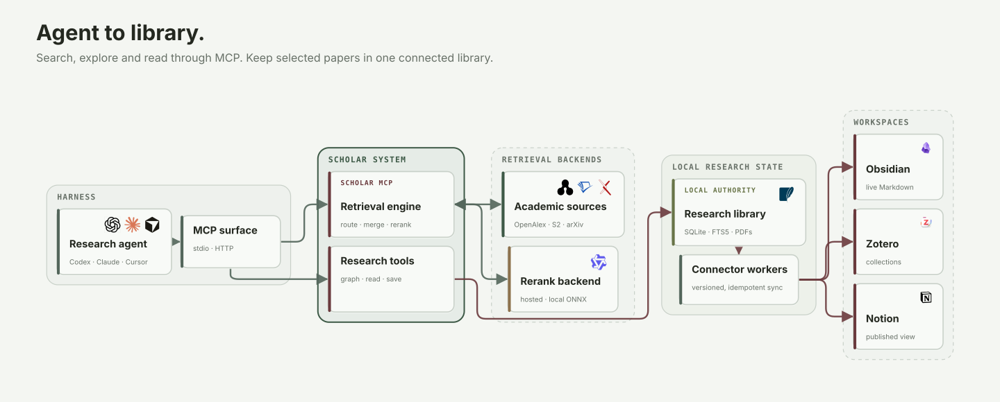

<!-- mcp-name: io.github.liyux3/scholar-mcp -->

<p align="center">
  <picture>
    <source media="(prefers-color-scheme: dark)" srcset="docs/assets/scholar-mcp-logo-dark.svg">
    <source media="(prefers-color-scheme: light)" srcset="docs/assets/scholar-mcp-logo.svg">
    
  </picture>
</p>

<h3 align="center">Go deeper.</h3>

<p align="center">
  Find the paper. Follow the evidence. Build the field.
</p>

<p align="center">
  <a href="https://pypi.org/project/scholar-mcp"></a>
  <a href="https://www.python.org/"></a>
  <a href="LICENSE"></a>
  <a href="https://modelcontextprotocol.io"></a>
</p>

Scholar MCP turns a research question into a connected body of evidence. It recovers papers from vague descriptions, reaches the work one hop beyond search, opens the primary text, maps the lineage, and carries the selected field into a library that grows with every session.

`Natural-language discovery` · `Citation expansion` · `Primary evidence` · `Field maps` · `Zotero · Obsidian · Notion connectors`

## Quick demo


One continuous agent flow: `search_papers` → `build_paper_graph` → `paper_info` + `read_paper` → `paper_library` → library connectors.

## How it works




Agents call typed MCP tools over stdio or Streamable HTTP. Scholar returns concise text and structured data, while a persistent SQLite library drives FTS5 search, PDF attachments, JSONL snapshots, and Obsidian, Zotero, and Notion connectors.

## Quick start

Claude Code:

```bash
claude mcp add scholar -- uvx scholar-mcp
```

Claude Desktop or any stdio MCP client:

```json
{
  "mcpServers": {
    "scholar": {
      "command": "uvx",
      "args": ["scholar-mcp"]
    }
  }
}
```

The direct server exposes the compact core profile. Python 3.10+ and [uv](https://docs.astral.sh/uv/) are required. Optional source keys unlock deeper coverage and higher throughput.

The repository also ships a research plugin with citation graphs, a local paper library, and the Deep Research skill:

```bash
# Codex
codex plugin marketplace add Liyux3/scholar-mcp
codex plugin add scholar-mcp@scholar-mcp

# Claude Code
claude plugin marketplace add Liyux3/scholar-mcp
claude plugin install scholar-mcp@scholar-mcp
```

The same plugin directory follows the Agent Plugins standard for Cursor, Pi, and compatible harnesses. OpenCode can launch `uvx scholar-mcp` as a local MCP; Pi can use `pi-mcp-adapter`.

## Tools

| Profile | Tool | Responsibility |
|---|---|---|
| Core | `search_papers` | Multi-source retrieval, filters, reranking, and citation expansion |
| Core | `paper_info` | Paper detail, citations, and references through one selective call |
| Core | `recommend_papers` | Related work through semantic and citation connections |
| Core | `search_authors` | Author profiles, affiliations, paper counts, and h-index |
| Core | `read_paper` | Temporarily fetch and read primary evidence |
| Core | `download_paper` | Persist a PDF and index it in a collection |
| Research | `build_paper_graph` | Bounded citation graph with PageRank, bridges, nodes, edges, and Mermaid |
| Research | `paper_library` | Collections, FTS search, notes, tags, PDFs, and Markdown vault export |

`scholar://status` reports source availability and the actual reranker used without occupying the tool surface. Tool responses retain concise YAML text and also expose structured MCP data.

The bundled Deep Research skill turns search, paper inspection, graph traversal, and selected library writes into a living field map.

## Retrieval

| Channel | Sources | Query form and role |
|---|---|---|
| Semantic | OpenAlex semantic, arxiv.gg, optional Exa | Full natural-language question |
| Full text | Semantic Scholar snippet search | Matching passages from open-access papers |
| Broad metadata | OpenAlex, Semantic Scholar, Crossref, optional Scopus | Identity, coverage, citations, and filters |
| Preprints and conferences | arXiv, OpenReview | Recent work and conference records |
| Biomedical | PubMed, Europe PMC | Medicine, biology, and full-text repositories |
| Domain and repository | DBLP, INSPIRE-HEP, DOAJ, CORE | CS, physics, open journals, and repositories |
| Web fallback | Google Scholar | Best effort; blocking is reported as degradation |

Keyword APIs receive measured source-specific query budgets. Semantic endpoints keep the original question. Every source contributes independently to one canonical evidence pool.

Results are canonicalized across DOI, arXiv, Semantic Scholar, OpenAlex, PubMed, and OpenReview identities. Duplicate records contribute complementary metadata and independent source evidence instead of appearing several times.

DashScope `qwen3-rerank` is the primary reranker when configured; FlashRank is the local fallback. The normal response shows only source coverage, the actual reranker, and actionable degradation. `debug=true` adds per-source yield, latency, provenance, and internal ranking diagnostics.

## Measured retrieval quality


Scholar leads the Exa research-paper baseline by **10 points at R@5** and **6 points at R@20** on matched LitSearch.

| System | R@5 | R@10 | R@20 | MRR |
|---|---:|---:|---:|---:|
| **Scholar + expansion** | **0.62** | **0.68** | **0.70** | **0.442** |
| Exa `research paper` | 0.52 | 0.58 | 0.64 | 0.435 |
| Scholar first pass | 0.44 | 0.56 | 0.64 | 0.335 |

Expansion is where Scholar earns the lead: nine queries were R@5 hits only for Scholar, while four were hits only for Exa.

<details>
<summary>Benchmark protocol</summary>

The comparison uses the same 50 LitSearch inline-ACL queries, the same ground-truth titles, and the same title matcher. Exa ran with category `research paper` and 20 returned results. Scholar used source-specific routing, Qwen reranking, and citation expansion. The cached best run was collected on 12 May 2026; scripts and scoring utilities live under `eval/`, with the paired result summary in [`docs/benchmarks/litsearch-inline-acl-50.json`](docs/benchmarks/litsearch-inline-acl-50.json).

</details>

## Citation graph and paper library


Rendered from a live local collection, the graph reveals foundations, bridges, and the papers that move a field forward. Stable identities and parallel citation traversal keep the map connected as it grows.

The paper library uses one persistent SQLite authority with WAL transactions and FTS5 search. Existing JSONL collections migrate automatically and remain available as compatibility snapshots. Stable identifiers, notes, tags, PDF paths, connector IDs, and sync revisions stay attached to the same canonical record.

Default data layout:

```text
~/.scholar-mcp/
├── papers/    persistent PDFs
├── kb/
│   ├── library.sqlite3    authority + FTS5 + sync state
│   └── *.jsonl            compatibility snapshots
└── vault/                 Markdown projections and wikilinks
```

### Library connectors

```bash
# No login: write directly into an Obsidian vault
scholar-mcp library export obsidian --collection rag --path /path/to/vault

# Dry-run by default; add --apply for external writes
scholar-mcp library sync zotero --collection rag
scholar-mcp library publish notion --collection rag
```

[Obsidian](https://help.obsidian.md/Files+and+folders/Manage+vaults) is a live Markdown projection. [Zotero](https://www.zotero.org/support/dev/web_api/v3/write_requests) manages bibliographic items, collections, tags, and notes. [Notion](https://developers.notion.com/reference/post-page) receives a one-way reading-list view. External connectors keep their IDs, versions, and content hashes in SQLite, so unchanged papers do not publish twice.

## Paper access

`read_paper` uses a temporary directory and leaves no retained PDF. `download_paper` persists the file, reuses a valid local copy, and indexes its metadata in the selected collection.

The shared resolution chain covers:

1. Semantic Scholar and arXiv open access
2. CORE and PubMed Central
3. bioRxiv, medRxiv, SSRN, ChemRxiv, and other preprint servers
4. Unpaywall and an optional institutional proxy
5. an explicit local fallback when enabled

## Configuration

All credentials are optional and remain in the MCP process environment.

| Variable | Purpose |
|---|---|
| `SCHOLAR_DATA_DIR` | Shared data root; default `~/.scholar-mcp` |
| `SCHOLAR_KB_DIR` | SQLite library and JSONL snapshot directory |
| `SCHOLAR_OBSIDIAN_VAULT` | Obsidian projection root; no authentication required |
| `S2_API_KEY` / `S2_API_KEYS` | Semantic Scholar search, snippets, graph, and rate limits |
| `OPENALEX_API_KEY` / `OPENALEX_API_KEYS` | OpenAlex search, semantic search, and graph calls |
| `OPENALEX_EMAIL` | OpenAlex polite pool and Unpaywall |
| `DASHSCOPE_API_KEY` | Qwen reranker |
| `SCOPUS_API_KEY` | Optional Scopus metadata source |
| `CORE_API_KEY` | Optional CORE repository source |
| `EXA_API_KEY` | Optional Exa research-paper source |
| `OPENREVIEW_USERNAME`, `OPENREVIEW_PASSWORD` | OpenReview API |
| `SCHOLAR_SOURCE_BUDGET_S` | Initial source fan-out budget; default 8 seconds |
| `SCHOLAR_DOWNLOAD_DIR` | Persistent PDF directory; default `<data>/papers` |
| `SCHOLAR_MCP_EXTENSIONS` | Use `research` for graph and paper-library tools |
| `ZOTERO_API_KEY`, `ZOTERO_LIBRARY_ID` | Zotero Web API or authorized local API connector |
| `ZOTERO_LIBRARY_TYPE`, `ZOTERO_API_BASE` | Optional Zotero library type and endpoint override |
| `NOTION_API_KEY`, `NOTION_DATA_SOURCE_ID` | Notion one-way publisher |

Errors returned to the model redact request URLs and credentials.

## Development

```bash
git clone https://github.com/Liyux3/scholar-mcp.git
cd scholar-mcp
uv sync --extra dev
uv run pytest
```

Unit tests are the default. Live API tests are marked `integration` so routine validation stays deterministic.

Local and Docker clients use stdio by default. Set `SCHOLAR_MCP_TRANSPORT=http` for Streamable HTTP; the default endpoint is `/mcp`.

## License

Apache License 2.0
