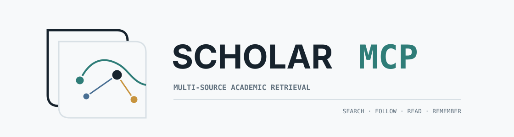
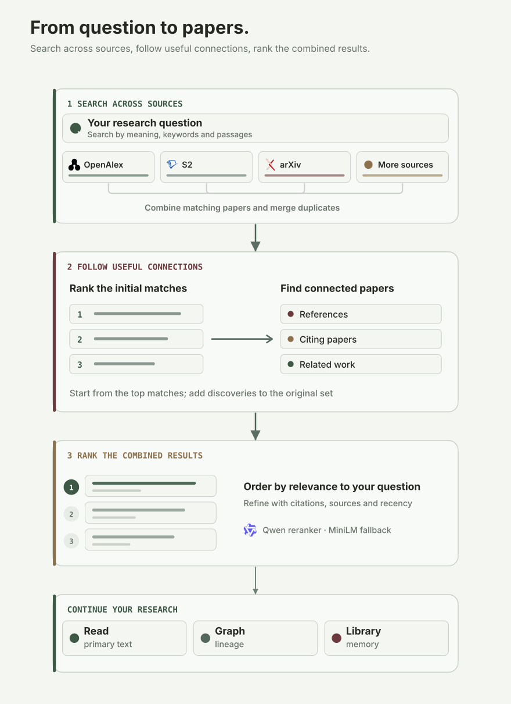
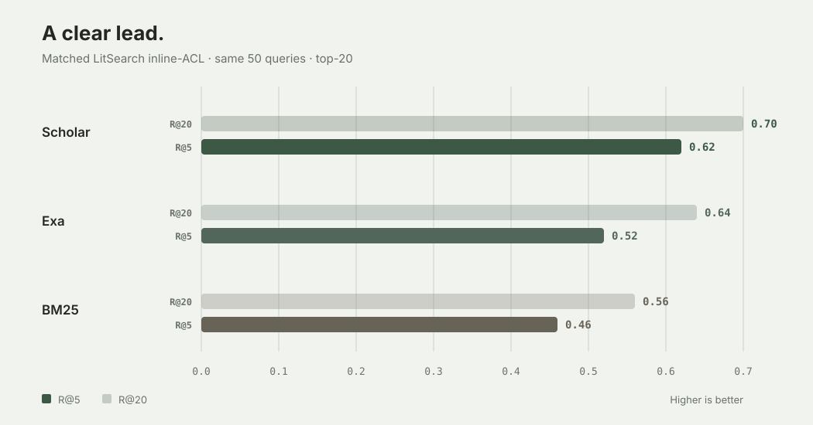
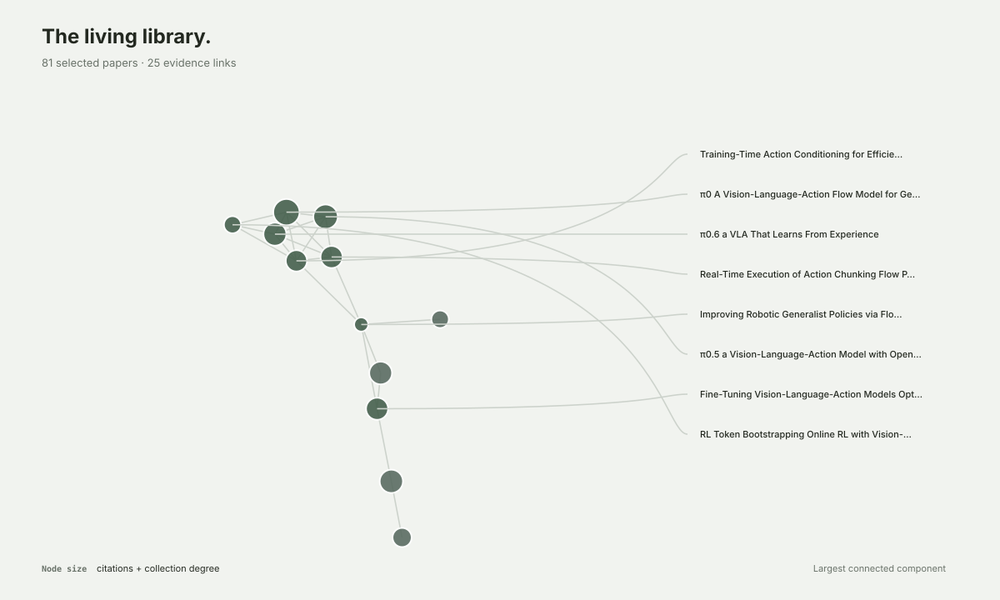

<!-- mcp-name: io.github.liyux3/scholar-mcp -->

<p align="center">
  <picture>
    <source media="(prefers-color-scheme: dark)" srcset="docs/assets/scholar-mcp-logo-dark.svg">
    <source media="(prefers-color-scheme: light)" srcset="docs/assets/scholar-mcp-logo.svg">
    
  </picture>
</p>

<h3 align="center">Research beyond the first result.</h3>

<p align="center">
  Multi-source academic retrieval, citation expansion, paper reading, graphs, and a durable research library — one MCP.
</p>

<p align="center">
  <a href="https://pypi.org/project/scholar-mcp"></a>
  <a href="https://www.python.org/"></a>
  <a href="LICENSE"></a>
  <a href="https://modelcontextprotocol.io"></a>
</p>

Scholar MCP gives a research agent one evidence path from an open-ended question to the papers that answer it. It searches semantic, keyword, full-text, domain, and citation channels in parallel; resolves duplicate identities; reranks the evidence; then follows the references and related work that a first-pass search leaves behind.

## Quick demo


The 12-second flow shows the full difference: Scholar preserves intent per source, merges duplicate records into canonical papers, follows the literature beyond the first-pass results, then turns selected work into primary evidence, a citation graph, and durable research memory.

## How it works



## Quick start

Claude Code:

```bash
claude mcp add scholar -- uvx scholar-mcp
```

Claude Desktop or any stdio MCP client:

```json
{
  "mcpServers": {
    "scholar": {
      "command": "uvx",
      "args": ["scholar-mcp"]
    }
  }
}
```

The direct server exposes the compact core profile. Python 3.10+ and [uv](https://docs.astral.sh/uv/) are required; basic use works without credentials, while optional keys improve coverage and rate limits.

The repository also ships a research plugin with citation graphs, a local paper library, and the Deep Research skill:

```bash
# Codex
codex plugin marketplace add Liyux3/scholar-mcp
codex plugin add scholar-mcp@scholar-mcp

# Claude Code
claude plugin marketplace add Liyux3/scholar-mcp
claude plugin install scholar-mcp@scholar-mcp
```

The same plugin directory follows the Agent Plugins standard for Cursor, Pi, and compatible harnesses. OpenCode can launch `uvx scholar-mcp` as a local MCP; Pi can use `pi-mcp-adapter`.

## Tools

| Profile | Tool | Responsibility |
|---|---|---|
| Core | `search_papers` | Multi-source retrieval, filters, reranking, and citation expansion |
| Core | `paper_info` | Paper detail, citations, and references through one selective call |
| Core | `recommend_papers` | Semantic neighbors, co-citation peers, and bibliographic kin |
| Core | `search_authors` | Author profiles, affiliations, paper counts, and h-index |
| Core | `read_paper` | Temporarily fetch and read primary evidence |
| Core | `download_paper` | Persist a PDF and index it in a collection |
| Research | `build_paper_graph` | Bounded citation graph with PageRank, bridges, nodes, edges, and Mermaid |
| Research | `paper_library` | Collections, FTS search, notes, tags, PDFs, and Markdown vault export |

`scholar://status` reports source availability and the actual reranker used without occupying the tool surface. Tool responses retain concise YAML text and also expose structured MCP data.

Field discovery is a dynamic workflow in the bundled Deep Research skill. It iterates over search, paper inspection, graph traversal, and curated library writes instead of running one fixed citation threshold over an unreviewed candidate pool.

## Retrieval

| Channel | Sources | Query form and role |
|---|---|---|
| Semantic | OpenAlex semantic, arxiv.gg, optional Exa | Full natural-language question |
| Full text | Semantic Scholar snippet search | Matching passages from open-access papers |
| Broad metadata | OpenAlex, Semantic Scholar, Crossref, optional Scopus | Identity, coverage, citations, and filters |
| Preprints and conferences | arXiv, OpenReview | Recent work and conference records |
| Biomedical | PubMed, Europe PMC | Medicine, biology, and full-text repositories |
| Domain and repository | DBLP, INSPIRE-HEP, DOAJ, CORE | CS, physics, open journals, and repositories |
| Web fallback | Google Scholar | Best effort; blocking is reported as degradation |

Keyword APIs receive measured source-specific query budgets. Semantic endpoints retain the original question. Sources answer in parallel, and one source failing reduces coverage without failing the request.

Results are canonicalized across DOI, arXiv, Semantic Scholar, OpenAlex, PubMed, and OpenReview identities. Duplicate records contribute complementary metadata and independent source evidence instead of appearing several times.

DashScope `qwen3-rerank` is the primary reranker when configured; FlashRank is the local fallback. The normal response shows only source coverage, the actual reranker, and actionable degradation. `debug=true` adds per-source yield, latency, provenance, and internal ranking diagnostics.

## Measured retrieval quality



In its best matched 50-query LitSearch inline-ACL run, the full Scholar pipeline beats the Exa research-paper baseline by **10 points at R@5** and **6 points at R@20**.

| System | R@5 | R@10 | R@20 | MRR |
|---|---:|---:|---:|---:|
| **Scholar + expansion** | **0.62** | **0.68** | **0.70** | **0.442** |
| Exa `research paper` | 0.52 | 0.58 | 0.64 | 0.435 |
| Scholar first pass | 0.44 | 0.56 | 0.64 | 0.335 |

Expansion is where Scholar earns the lead: nine queries were R@5 hits only for Scholar, while four were hits only for Exa.

<details>
<summary>Benchmark protocol</summary>

The comparison uses the same 50 LitSearch inline-ACL queries, the same ground-truth titles, and the same title matcher. Exa ran with category `research paper` and 20 returned results. Scholar used source-specific routing, Qwen reranking, and citation expansion. The cached best run was collected on 12 May 2026; scripts and scoring utilities live under `eval/`, with the paired result summary in [`docs/benchmarks/litsearch-inline-acl-50.json`](docs/benchmarks/litsearch-inline-acl-50.json).

</details>

## Citation graph and paper library



This graph is rendered from a real local collection rather than a mock network. Graph construction resolves stable seeds, fetches citation and reference neighborhoods in parallel, merges duplicate identities, reports analytics as structured data, and keeps topic drift bounded.

The paper library keeps existing JSONL collections compatible and builds a lightweight SQLite FTS5 index in memory for ranked local search. It supports stable identifiers, metadata upserts, notes, tags, PDF paths, removal, and Obsidian-compatible Markdown export.

Default data layout:

```text
~/.scholar-mcp/
├── papers/    persistent PDFs
├── kb/        JSONL collections
└── vault/     Markdown projections and wikilinks
```

## Paper access

`read_paper` uses a temporary directory and leaves no retained PDF. `download_paper` persists the file, reuses a valid local copy, and indexes its metadata in the selected collection.

The shared resolution chain covers:

1. Semantic Scholar and arXiv open access
2. CORE and PubMed Central
3. bioRxiv, medRxiv, SSRN, ChemRxiv, and other preprint servers
4. Unpaywall and an optional institutional proxy
5. an explicit local fallback when enabled

## Configuration

All credentials are optional and remain in the MCP process environment.

| Variable | Purpose |
|---|---|
| `SCHOLAR_DATA_DIR` | Shared data root; default `~/.scholar-mcp` |
| `S2_API_KEY` / `S2_API_KEYS` | Semantic Scholar search, snippets, graph, and rate limits |
| `OPENALEX_API_KEY` / `OPENALEX_API_KEYS` | OpenAlex search, semantic search, and graph calls |
| `OPENALEX_EMAIL` | OpenAlex polite pool and Unpaywall |
| `DASHSCOPE_API_KEY` | Qwen reranker |
| `SCOPUS_API_KEY` | Optional Scopus metadata source |
| `CORE_API_KEY` | Optional CORE repository source |
| `EXA_API_KEY` | Optional Exa research-paper source |
| `OPENREVIEW_USERNAME`, `OPENREVIEW_PASSWORD` | OpenReview API |
| `SCHOLAR_SOURCE_BUDGET_S` | Initial source fan-out budget; default 8 seconds |
| `SCHOLAR_DOWNLOAD_DIR` | Persistent PDF directory; default `<data>/papers` |
| `SCHOLAR_MCP_EXTENSIONS` | Use `research` for graph and paper-library tools |

Errors returned to the model redact request URLs and credentials.

## Development

```bash
git clone https://github.com/Liyux3/scholar-mcp.git
cd scholar-mcp
uv sync --extra dev
uv run pytest
```

Unit tests are the default. Live API tests are marked `integration` so routine validation stays deterministic.

Local and Docker clients use stdio by default. Set `SCHOLAR_MCP_TRANSPORT=http` for Streamable HTTP; the default endpoint is `/mcp`.

## License

Apache License 2.0
